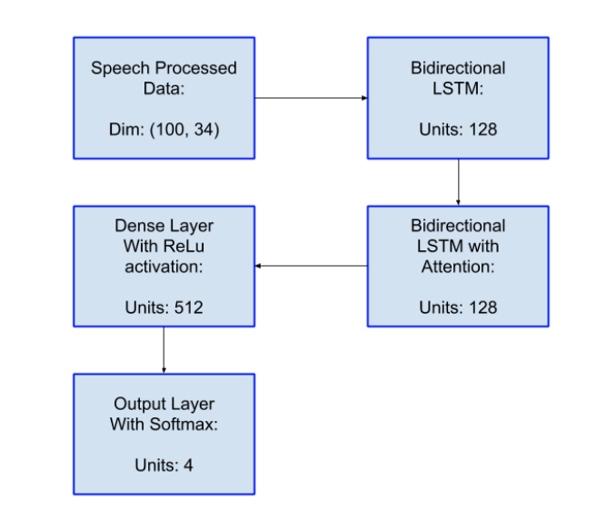
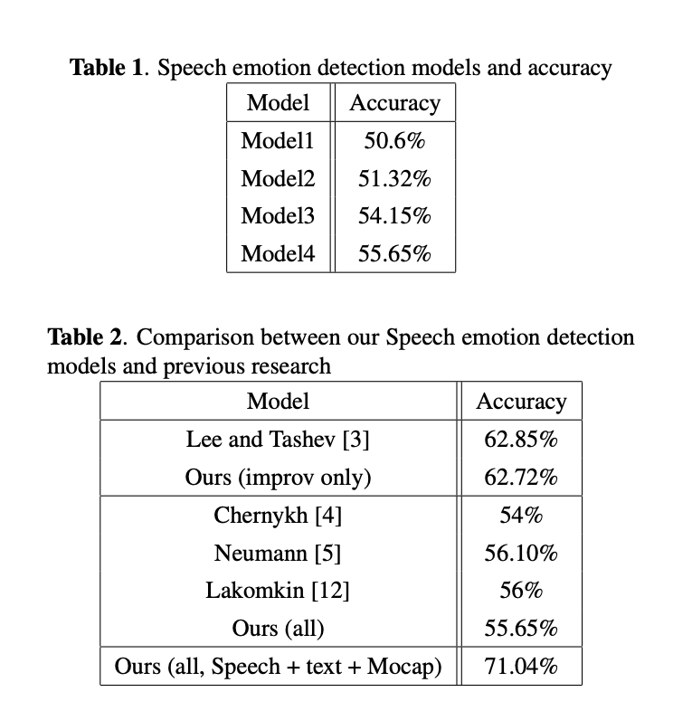
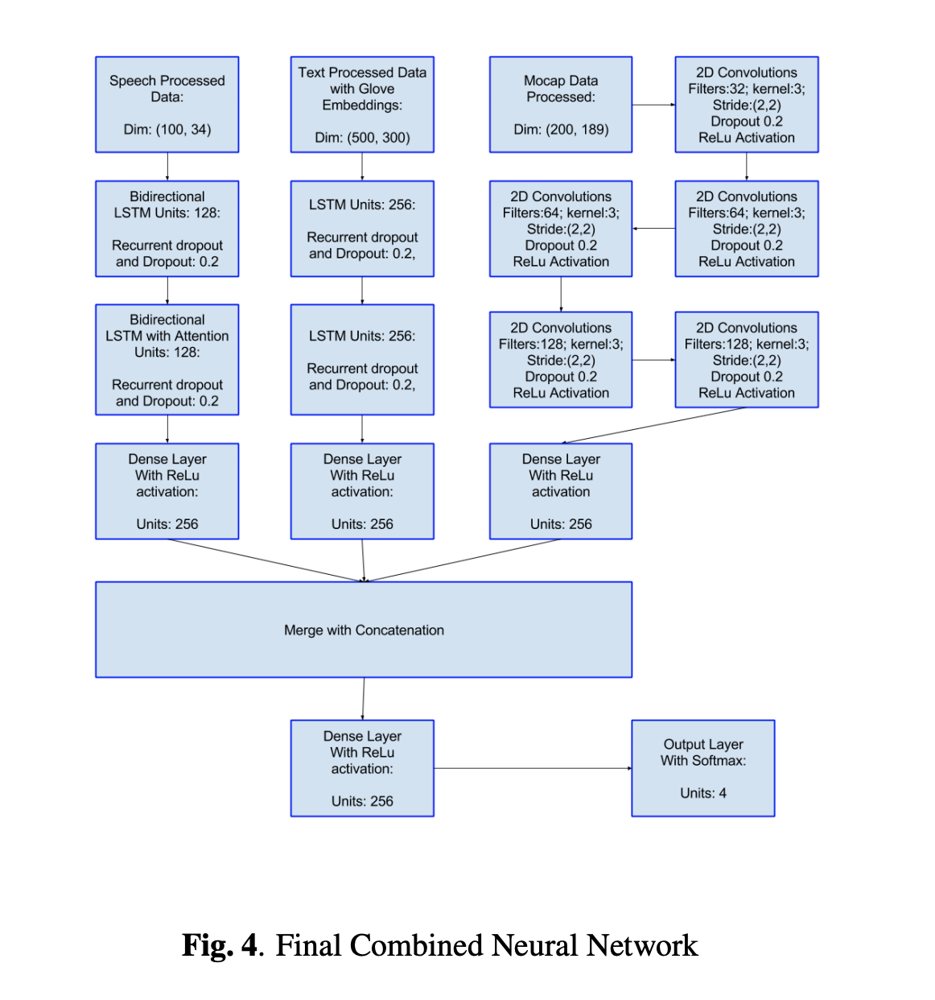

# Multi-Modal Emotion recognition on IEMOCAP with neural networks

[https://arxiv.org/abs/1804.05788](https://arxiv.org/abs/1804.05788)

## INSTRODUCTION AND RELATED WORKS

- IEMOCAP dataset

: 12 hours of audio-visual data, including facial recordings, speech and text transcriptions.

 In this paper we combine these modes to make stronger and more robust detector for emotions. However most of the research on IEMOCAP has concentrated specifically on emotion detection using Speech data points.

- early methods

: One of the early important papers on this dataset is [10] which beat state of the art by 20% over techniques that used HMMs (Hidden Markov Models), SVMs (Support Vector Machines) [11] and other shallow learning methods. 

→ **HMMs (Hidden Markov Models), SVMs (Support Vector Machines) 를 초기에 사용하였다.** 

They perform segment level feature extraction, feed those features to a MLP based architecture, where the input is 750 dimensional feature vector, followed by 3 hidden layer of 256 neurons each with rectilinear units as non-linearity

→ **750 dim 의 feature vector 와 3 hidden layer (256 neurons) 를 사용했다.** 

[3] follows [10] and they train long short-term memory (LSTM) based recurrent neural network. First they divide each utterance into small segments with voiced region, then assume that the label sequences of each segment follows a Markov chain. They extract 32 features for every frame: F0 (pitch), voice probability, zerocrossing rate, 12-dimensional Mel-frequency cepstral coefficients (MFCC) with log energy, and their first time derivatives. The network contains 2 hidden layers with 128 BLSTM cells (64 forward nodes and 64 backward nodes).

→ **LSTM 을 사용한 연구에서 each utterance into small segments with voiced region, then assume that the label sequences of each segment follows a Markov chain 하다고 생각했다. 32개의 feature 를 매 프래임마다 뽑았고, ( F0 (pitch), voice probability, zerocrossing rate, 12-dimensional Mel-frequency cepstral coefficients (MFCC) with log energy, and their first time derivatives. ) 를 사용하였다. 2개의 hidden layer (128 BLSTM cells) 를 사용했다.**

Another research we closely follow is [4], where they
use CTC loss function to improve upon RNN based Emotion prediction. They use 34 features including 12 MFCC, chromagram-based and spectrum properties like flux and rolloff. For all speech intervals they calculate features in 0.2 second window and moving it with 0.1 second step. The use of CTC loss helps, as often, almost the whole utterance has no
emotion, but emotionality is contained only in a few words or phonemes in an utterance which the CTC loss handles well.

**→ 다른 연구에서는 CTC loss function 을 이용하였고 34 개의 features 를 사용하였다. (12 MFCC, chromagram-based and spectrum properties like flux and rolloff) 모든 speech 간격은 0.2 초 window 와 0.1 second step 을 사용하였다. (CTC 손실의 사용은 종종 거의 모든 발화가 감정을 갖지 못하게하지만 CTC 손실이 잘 처리되는 발화의 몇 마디 또는 음소에만 감성이 포함됩니다. : 구글번역)**

Unlike [3] which uses only the improv data, Chernykh et. al. use all the session data for the emotion classification. Another important research on Speech based Emotion recognition is the work of [12] which uses transfer learning to improve on Neural Models for emotion detection. Their model uses 1D convolutions and GRU layers to initialize a neural
model for Automatic Speech Recognition inspired by Deep Speech. They use many datasets for ASR based training on CTC loss, and then fine-tune this model on IEMOCAP.

→ **transfer learning 을 이용할 시에 improve 되었으며 1D conv 와 GRU 를 뉴럴 모델을 초기화 하는 데 사용하였다. 그들은 CTC loss 로 학습된 ASR 데이터 셋을 사용하였으며 IEMOCAP 을 추후 훈련 시켰다.**

Our ensemble consists of Long Short Term Memory networks, Convolution Neural Networks, Fully connected Multi-Layer Perceptrons and we complement them using techniques such as Dropout, adaptive optimizers such as Adam, pretrained word-embedding models and Attention based RNN decoders. Comparing our speech based emotion detection with [3] we achieve 62.72% accuracy compared to their 62.85%; and comparing with [4] we achieve 55.65% accuracy compared to their CTC based 54% accuracy. After combining Speech (individually 55.65% accuracy) and Text (individually 64.78% accuracy) modes we achieve an improvement to 68.40% accuracy. When we also account MoCap data (individually 51.11% accuracy) we also achieve a further improvement to 71.04%.

→ **여기 애들은 LSTM, CNN, Fully connceted MLP 를 사용하였으며, dropout, adam 을 사용하였다. 멀티모달이어서 attention based rnn decoders 를 txt 쪽에 사용한 것 같다.** 

## Experiment Setup

IEMOCAP has 12 hours of audio-visual data from 10 actors where the recordings follow dialogues between a male and a female actor in both scripted or improvised topics. After the
audio-visual data has been collected it is divided into small utterances of length between 3 to 15 seconds which are then labelled by evaluators. Each utterance is evaluated by 3-4
assessors. The evaluation form contained 10 options (neutral, happiness, sadness, anger, surprise, fear, disgust, frustration,excited, other). 

→ **12 시간의 오디오/비쥬얼 데이터, 10명의 액터, 여성과 남성 배우의 dialogues 로 구성되어 있으며 스크립트가 있는 것과 즉흥적인 토픽등이 있다. 오디오 비쥬얼 데이터 가 모아진 뒤 이를 작은 3~15 초의 발언으로 나누었다. evalusators 에 대해서 labelled 되어진, 각 발언은 3-4명의 평가자에 의해 평가되었다. 이 평가는 10개의 옵션을 가지며 (중립, 행복, 슬픔, 화남, 놀람, 공포, 역겨움, 좌절, 흥분됨, 기타)**

We consider only 4 of them anger, excitement (happiness), neutral and sadness so as to remain consistent with the prior research. We consider emotions where at least
2 experts were consistent with their decision, which is more than 70 % of the dataset, again consistent with prior research.

→ **여기서는 4개의 감정에 대해서 고려했으며, 2개의 전문가가 그들을 결정했다. 70% 의 데이터셋.**

Along with the .wav file for the dialogue we also have available the transcript each the utterance. For each session one actor wears the Motion Capture (MoCap) camera data
which records the facial expression, head and hand movements of the actor. The Mocap data contains column tuples, for facial expressions the tuples are contained in 165 dimensions, 18 for hand positions and 6 for head rotations. As this Mocap data is very extensive we use it instead of the video recording in the dataset. These three modes (Speech, Text, Mocap) of data form the basis of our multi-modal emotion
detection pipeline.

→ **.wav 음성 파일과 함께 발화는 각 발언에 대한 서술(글)을 가진다. 각 액터는 motion capture 카메라를 입었고 얼굴표정, 머리/손의 움직임을 기록했다. 비전 데이터의 Input column 는 얼굴 표정의 경우 165개의 차원을 가지며, 18 개의 hand position, 6개의 head rotations 차원을 가진다.** 

Next we preprocess the IEMOCAP data for these modes. For the speech data our preprocessing follows the work of [4]. We use the Fourier frequencies and energy-based features Mel-frequency cepstral coefficients (MFCC) for a total of 34
features. They include 13 MFCC, 13 chromagram-based and 8 Time Spectral Features like zero crossing rate, short-term energy, short-term entropy of energy, spectral centroid and
spread, spectral entropy, spectral flux, spectral rolloff. We calculate features in 0.2 second window and moving it with 0.1 second step and with 16 kHz sample rate. We keep a maximum of 100 frames or approximately for 10 seconds of the input, and zero pad the extra signal and end up with (100,34) feature vector for each utterance. We also experiment with
delta and double-delta features of MFCC but they dont produce any performance improvement while adding extra computation overhead.

**→ 여기서 전처리의 경우는 34 개의 features 를 사용하였는데, 13 MFCC, 13 chromagram-based and 8 Time Spectral Features like zero crossing rate, short-term energy, short-term entropy of energy, spectral centroid and spread, spectral entropy, spectral flux, spectral rolloff. 을 사용하였다. 0.2 초의 window 와 0.1 초 step 을 이용하였으며 16kHz sample rate 을 사용하였다. 우리는 최대 100 프레임을 유지하고 근사적으로 10초의 input 을 사용했다. extra signal 에 zero pad 를 사용하였으며, 각 발언에서 10034 피쳐 백터를 얻었다. 우리는 mfcc 의 delta, double-delta 피쳐를 추가적으로 실험했으나 더 성능이 향상되지 않았고 더 계산이 많이 필요했다.** 

For the text transcript of each of the utterance we use pretrained Glove embeddings [13] of dimension 300, along with the maximum sequence length of 500 to obtain a (500,300)
vector for each utterance. For the Mocap data, for each different mode such as face, hand, head rotation we sample all the feature values between the start and finish time values and
split them into 200 partitioned arrays. We then average each of the 200 arrays along the columns (165 for faces, 18 for hands, and 6 for rotation), and finally concatenate all of them
to obtain (200,189) dimension vector for each utterance

구글 번역 : 음성 아니라서 귀찮

각각의 발화문에 대한 텍스트 사본에는 차원 300의 사전 장갑 붙임 [13]과 각 발화에 대한 (500,300) 벡터를 얻기위한 최대 시퀀스 길이 500을 사용합니다.
Mocap 데이터의 경우 얼굴, 손, 머리 회전과 같은 각기 다른 모드에 대해 시작 및 종료 시간 값 사이의 모든 특성 값을 샘플링하고 200 개의 분할 된 배열로 분할합니다.
그런 다음 열을 따라 200 개의 배열을 평균화합니다 (얼굴 165, 손 18, 회전 6). 그리고 마지막으로 모두 연결하여 각 발화에 대한 치수 벡터를 얻습니다 (200,189).

## Models and Result

### Speech Based Emotion Detection

Our first model (Model1) consists of three layered Fully Connected MLP layers with 1024,512,256 hidden neural units with Relu as activation and 4 output neurons with Softmax.
The model takes the flattened speech vectors as input and trains using cross entropy loss with Adadelta as the optimizer.

**→ Model 1 은 3개의 layer의 fully connected MLP 로 되어있었으며 1024,512,256 개의 hidden neural units 로 되어있었고 relu 를 activation 으로 사용했다. 4 output 을 뉴론으로 사용했고 softmax 를 사용했다.** 

Model2 uses two stacked LSTM layers with 512 and 256 units followed by a Dense layer with 512 units and Relu Activation. 

→ **Model 2 는 2개의 stacked 512, 256 units LSTM layers 와 512 units 의 relu activation 으로 구성된 dense layer 로 이루어져 있다.** 

Model3 uses 2 LSTM layers with 128 units each but the second LSTM layer has Attention implementation as well, followed by 512 units of Dense layer with ReLu activation. 

→ **Model 3는 2개의 128 unit 의 각 LSTM layers 로 되어 있고 2번째 LSTM layer 는 attention 을 수행하였으며, 512 units 의 relu activation 의 dense layer 가 뒤따랐다.** 

Model4 improves both the encoding LSTM and Attention based decoding LSTM by making them bi-directional. 

→ **Model 4 는 두개다 encoding LSTM 과 attention 이 된 decoding LSTM 을 사용하여 bi-directional 로 구성하였다.** 

All these last 3 models use Adadelta as the optimizer. We divide our dataset with a randomly chosen 20% validation split and report our accuracies based this set. As we can see the final Attention based LSTM model performs the best. We also try many variations of the speech data including using MelSpectrogram, smaller window (0.08s) with longer context (200 timestamps) as well as combining these approaches into one big network but do not achieve improvements.

→ **모든 3개의 모델은 Adadelta 를 옵티마이져로 사용하였으며, 우리의 데이터셋을 랜덤하게 20% 의 validation 셋으로 설정하고 accuracy 를 이에 기초하여 층정하였다. 우리는 마지막 모델인 final attention based lstm 모델이 가장 좋은 성능을 나타냄을 알 수 있었다.** 

**추가적으로 speech data 에 melspectrogram 이나 더 작은 window 0.08ch, 또는 더 긴 context 인 200 timestamps 를 결합하여 하나의 큰 네트워크에 넣었으나 성능 향상을 보지 못하였다.** 

To compare our results with prior research we use our best
model (Model4) and evaluate it in the manner similar to various conditions of the previous researches. We train using Session1-4 and use Session5 as our test set. Like [3] we use
only the improvisation session for both Training and Testing and achieve similar results. To compare with [4] [5] [12] who use the both scripted and Improvisation sessions we again
achieve similar results. One important insight of our results is with minimal preprocessing and no complex loss functions or noise injection into the training, we can easily match prior
research’s performance using Attention based Bidirectional LSTMs.

→ **우리의 결과를 이전 리서치들과 비교해보기 위하여 우리는 최고 성능 모델인 모델 4 를 이전 연구들에서 비슷한 조건에서 시험해보았다. 세션 1~4를 trainig set 으로  세션 5 를 test set 으로 사용하였다. 연구 [3] 과 같이 즉흥 데이터셋만을 사용할 시에 비슷한 결과를 얻었다. 스크립트와 즉흥적인 데이터 모두를 사용한 것도 비슷한 결과를 얻었다.  중요한 인사이트는 최소 전처리, 복잡하지 않은 로스 함수, noise를 학습데이터에 집어넣는 것등이 있었다. 우리는 이전 연구 성능에 attension based bidirection lstms 를 쉽게 매칭할 수 있었다.** 

다른 데이터의 경우 설명이 더 있으나 번역하지않았음

### Combined Multi-modal Emotion Detection

For the final part of our experiment we train models using all the three modes discussed above. We first use the text transcript and speech based vectors for one model. We try architectures which use Model1 of text processing and Model1 of speech processing architectures, both without the output neurons, their final hidden layers concatenated to 512 dimension hidden layer feeding into 4 output neurons. This architecture does not yield good results. We then try a new model (Model1) which uses 3 Dense layers (1024,512,256)
neurons each for both text and speech features concatenated followed by another Dense layer with 256 neurons using Relu and Dropout of 0.2 and 4 output softmax neurons. Our
Model2 uses 256 units of 2 stacked LSTMS followed by a Dense layer with 256 neurons for text data; 2 Dense layers with 1024 and 256 neurons for speech data; concatenated

followed by another Dense layer with 256 neurons using
Relu and Dropout of 0.2 and 4 output softmax neurons. Both
Model1 and Model 2 use random initalizations of 128 dimensional embeddings. For Model3 we replace Model2 with Glove embeddings. We then proceed to also include MoCap data as well into one complete model. For Model4 we combine the previous Model3 with MoCap based Model 2 and concatenate all three 256 layer final outputs. For Model5 we combine the previous Model3 with MoCap based Model1 and concatenate all three
256 layer final outputs. For Model6 we replace the Dense Layers in Speech mode part of previous Model4 with Attention based LSTM architectures. All the code is openly available for reference.

