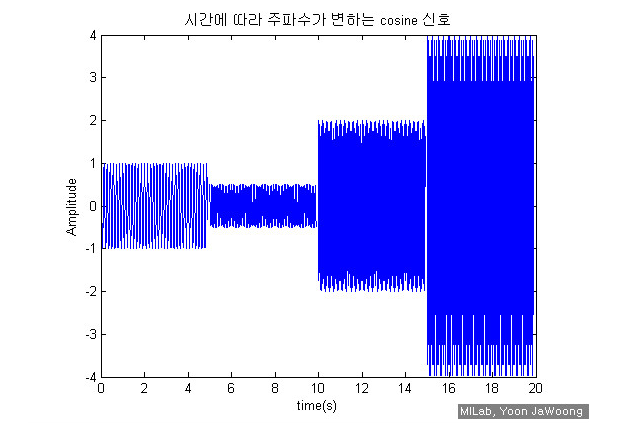
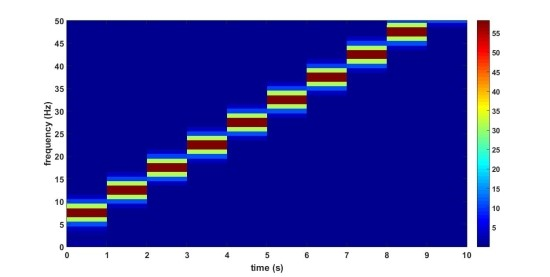

# STFT_MFCC_Melspectrogram.md

# STFT

국소 푸리에 변환이라고 하며 FFT 는 시간 차원에서 주파수 차원으로 변환하며 , **어떤 주파수를 얼만큼 가지고 있는지 명백히 보여주지만, 시간의 흐름에 따라서 어느시간대에 주파수가 얼만큼 변했는 지 알기 어려운 단점이 있다.**

-4b90ceda-5cf5-417a-8f01-2bd37883351e.png)

                                                                    <출처 : ₩ >

STFT는 신호를 분석하는 강력한 방법이다. 하지만 단점이 없는 것은 아닙니다. STFT의 가장 큰 단점은 **초기 신호를 Window length에 따라서 분리시키기 때문에 푸리에 변환에 사용되는 신호의 길이를 감소시키고 이에 따라 주파수 Resolution이 악화**되는 것입니다. 그렇다고 **Window length를 증가시켜 주파수 Resolution을 향상시켜도 시간에 대한 Resolution은 반대로 악화**됩니다. 이러한 주파수와 시간의 Trade off 관계로 인한 Resolution의 한계를 완화시키기 위한 방법이 **Overlap**입니다.

Window length와 Overlap에 대해 연습해보도록 하겠습니다. 전편에서 STFT는 신호의 구간을 나누는 것이라고 설명해드렸습니다. Window는 이와 관련이 있는 것으로 주파수 정보를 시간에 대한 축으로 표현하기 위해 사용됩니다. 다음 그림은 5Hz에서 50Hz까지 주파수가 일정하게 증가하는 신호에 대해서 1)Window length=1초, 2)Window length=3.3초 총 2가지 경우에 대해 STFT 분석을 한 것입니다. 

그림 1). Window length=1초

-18c8c642-d2e2-4302-8950-9f51c688eced.jpg)

그림 2). Window length=3.3초  

위의 그림을 보시면 같은 신호임에도 Window length에 따라 표현이 달라지는 것을 확인하실 수 있습니다. Window length가 작을 경우 그림 1)과 같이 시간에 대한 Resolution이 좋아집니다. 그러나 반대로 커질 경우 그림 2)와 같이 시간 Resolution이 단순해지는 것을 알 수 있습니다. 주파수 Resolution의 경우 반대로 그림 1)과 같은 경우 주파수 Resolution이 단순한 것을 알 수 있고 그림 2)는 좀더 세밀한 것을 확인할 수 있습니다. 

다음은 Overlap을 적용해 보겠습니다. **Overlap이란 WIndow를 적용할 때 Window가 서로 겹쳐져 적용되는 것을 말합니다.** 그림을 통해 설명해드리겠습니다.    

-f3eae53f-4bc8-4d7e-8375-0c4b4d4234b4.jpg)

그림 3). No overlap(왼쪽), Overlap 적용(오른쪽) 

위의 그림에서 왼쪽 그림은 Overlap을 적용하지 않은 것이고 오른쪽그림은 적용한 것입니다. 그림과 같이 Overlap을 적용하면 Window가 서로 겹쳐짐으로 인해 더 많은 Window가 적용되고 **이에 따라 시간에 대한 Resolution이 좋아지게 됩니다.** **그럼 그림 2)에 대해 Overlap 70%(Window가 70% 겹처짐)를 적용해보겠습니다.**                                                        

-8dcf79d2-62d5-455e-b18b-bdae09415e7b.jpg)

그림 4). 그림 2)에 대해서 Overlap을 적용한 경우그림 

4)를 보시면 그림 2)와 비교해서 Time Resolution이 확실하게 좋아진 것을 확인할 수 있습니다. 이번 시간에는 STFT의 Window length와 Overlap에 대해 알아보는 시간을 가졌습니다. **앞으로 STFT를 사용할 경우 적절한 Window length와 Overlap(%)를 선정하여 좀 더 좋은 분석 결과를 얻으시길 바랍니다.(일반적으로 Overlap 퍼센트는 50~75%사이로 사용)**

- stft : scipy library

[https://docs.scipy.org/doc/scipy-0.19.0/reference/generated/scipy.signal.stft.html](https://docs.scipy.org/doc/scipy-0.19.0/reference/generated/scipy.signal.stft.html)

딥러닝을 이용하여 음성 인식, 음성 처리, 화자 인식, 감정 인식 등에서 많이 쓰이는 음성의 특징 추출 방법은 1. MFCC, 2. Mel-Spectrogram 가 있다.

# MFCC

MFCC는 1980 대 Davis와 Mermelstein 에 의해 처음 소개 되었으며 지금까지도 MFCC에 기반한 많은 연구들이 나오고 있다. MFCC 이전에는 HMM Classifier를 이용한 Linear Prediction Coefficients(LPC) 와 Linear Prediction Cepstral Coefficient(LPCC) 기법이 음성 인식 기법으로 주로 활용되어 왔다. MFCC는 아래와 같이 6가지 단계로 나눌 수 있다.

1. 입력 시간 도메인의 소리 신호를 작은 크기 프레임으로 자른다

2. 각 프레임에 대하여 Power Spectrum의 Periodogram estimate (Periodogram Spectral Estimate)를 계산한다.

3. 2번에서 구한 Power Spectrum 에 Mel Filter bank를 적용하고, 각 필터에 에너지를 합한다.

4. 3번에서 구한 모든 필터 뱅크 에너지의 Log를 취한다.

5. 4번 값에 DCT를 취한다.

6. DCT를 취한 값에 Coefficients 2~13 만 남기고 나머지는 버린다.

**그럼 이제 각 단계에 대해 자세히 알아보면.....**

1 단계. 시간영역에서 입력된 소리 신호는 지속적으로 변화하게 된다. 따라서, 이런 변화하는 소리는 간단히 하기 위하여 짧은 시간내에서는 소리 신호가 많이 변하지 않는다고 가정 합니다.

여기서 말하는 "많이 변하지 않는다"는 의미는 실제로 신호의 변화가 없다는 것이 아니라, 짧은 구간에서 통계적으로 변화가 거의 없다는 것이다.

일반적으로 MFCC에서는 이 프레임의 길이는 20~40ms 정도로 정하고 있다. 물론 Sampling Rate에 따라 샘플의 수는 달라지겠지만, 44.1KHz 기준으로 대략 천개의 샘플이 된다.

만약 이 샘플의 수가 너무 적으면 주파수 분석에 신뢰도가 떨어지고, 이 값이 너무 크면 신호릐 변화가 한 프레임 내에서 너무 크게 되기 때문에, 분석이 어렵다.

2 단계. 각 프레임에 대해 파워 스팩트럼(주파수)를 계산한다. (Periodogram Spectral Estimation)

해부학적으로 인간의 귀는 입력된 소리의 주파수에 따라 달팽이관의 진동하는 부위가 다르다. 즉, 달팽이관의 어떤 지점이 진동하느냐에 따라, 각 달팽이관 신경들이 뇌에 어떤 주파수가 입력되었는지 알려주게된다. MFCC 에서 Periodogram Estimation (주기도 평가)은 인간의 이러한 기능과 비슷한 역활을 한다고 할 수 있다.

-----------------------------------------------------------------------------------------

사실, Periodogram Spectral Estimation 은 여전히 음성인식에 불필요한 많은 정보를 가지고 있다.

특히, 달팽이관은 인접한 주파수들 크게 구분하지 못한다. 저주파의 경우 잘 구분하지만, 고주파로 올라갈 수록 주파수 구분을 잘 못하게 된다. 때문에, Periodogram Bin 들의 그룹을 만들고, 이 그룹들을 합하는 방식으로 다양한 주파수들 사이에서 얼마만큼의 애너지가 있는지 얻을 수 있다. 이를 위하여 Mel Filter Bank를 활용한다.

-----------------------------------------------------------------------------------------

3 단계 : **Mel Filter Bank**

처음 필터는 매우 얇으며, 특히 0Hz(저주파) 주변에서 얼마만큼의 에너지가 있는지을 알려준다. 그리고, 주파수가 올라가면 갈 수록 필터의 폭은 넓어지며, 고주파가 되면 거의 고려하지 않게된다.

우리는 관심은 각 구간에서 얼마만큼의 에너지가 발생하는지만 대략적으로 아는 것에 있으며,

**Mel Scale**은 Filter Bank를 나눌 때 어떤 간격으로 나누어야 하는지 알려주며, 간격을 나누는 방법은 다음과 같다.

Mel Scale

Convert Frequency to Mel Scale :

Convert Mel Scale to Frequency :

4 단계 : Filter Bank 에너지가 입력되면, 이 값에 로그를 취한다. 이 압축 연산은 인간이 실제로 듣는것과 유사하게 소리의 특징을 만들 수 있다. 여기서 다시 Cube Root가 아니라, 로그를 취하는 이유는, 로그를 쓰게 되면, 이후에 채널 Noramlization 기법인 Cepstral Mean Subtraction을 사용할 수 있게 되기 때문이다.

로그를 취하는 이유는 인간의 귀는 소리의 크기를 Linear Scale 로 감지하는 것이 아니기 때문이다. 일반적으로 소리가 두배 크게 들리기 위해서는 실제로 에너지의 8배를 인가해야 한다고 한다. 이말은 즉, 만약 소리의 전체 크기가 크다면, 에너지 변화가 좀 크더라 하더라도 실제 큰 차이가 없을 수가 있다.

5 단계 : 로그가 취해진 Filter Bank 에너지에 DCT를 계산한다. 이 이유는 두가지 인데, Filter Bank는 모두 Overlapping 되어 있기 때문에 Filter Bank 에너지들 사이에 상관관계가 존재하기 때문이다. DCT는 에너지들 사이에 이러한 상관관계를 분리 해주는 역활을 하며, 따라서 Diagonal Covariance Matrice 를 사용할 수 있게 된다. (HMM Classifier 와 유사함)

6 단계 : 하지만 여기서 26개 DCT Coefficient 들 중 12만 남겨야 하는데, 그 이유는 DCT Coefficient 가 많으면, Filter Bank 에너지의 빠른 변화를 나타내게 되고, 이것은 음성인식의 성능을 낮추게 되기 때문이다.

MP3의 wave에서 mel filterbank(주파수별로 쪼갠 것)을 적용하여

을 계산한다음 DCT를 취하고 2~13에 해당하는 계수를 뽑은 것

즉 대충 파워스펙트럼을 구한다음 mel 스케일을 적용한 다음 DCT를 취한 것. DCT는 파동을 코사인 함수 N개로 표현하는 것. 그래서 이 DCT의 계수를 취한 다는 뜻은 일정한 주기를가진 코사인 12개의 계수를 가져온 것으로 보인다.

출처: [https://m.blog.naver.com/mylogic/220988857132](https://m.blog.naver.com/mylogic/220988857132)

- MFC 와 MFCC 의 관계

In [sound processing](https://en.wikipedia.org/wiki/Sound_processing), the **mel-frequency cepstrum** (**MFC**) is a representation of the short-term [power spectrum](https://en.wikipedia.org/wiki/Power_spectrum) of a sound, based on a [linear cosine transform](https://en.wikipedia.org/wiki/Cosine_transform) of a [log power spectrum](https://en.wikipedia.org/wiki/Power_spectrum) on a [nonlinear](https://en.wikipedia.org/wiki/Nonlinear_system) [mel scale](https://en.wikipedia.org/wiki/Mel_scale) of frequency.

**Mel-frequency cepstral coefficients** (**MFCCs**) are coefficients that collectively make up an MFC They are derived from a type of [cepstral](https://en.wikipedia.org/wiki/Cepstrum) representation of the audio clip (a nonlinear "spectrum-of-a-spectrum"). The difference between the [cepstrum](https://en.wikipedia.org/wiki/Cepstrum) and the mel-frequency cepstrum is that in the MFC, the frequency bands are equally spaced on the mel scale, which approximates the human auditory system's response more closely than the linearly-spaced frequency bands used in the normal cepstrum. This frequency warping can allow for better representation of sound, for example, in [audio compression](https://en.wikipedia.org/wiki/Data_compression#Audio).

MFCCs are commonly derived as follows:

1. Take the [Fourier transform](https://en.wikipedia.org/wiki/Fourier_transform) of (a windowed excerpt of) a signal.
2. Map the powers of the spectrum obtained above onto the [mel scale](https://en.wikipedia.org/wiki/Mel_scale), using [triangular overlapping windows](https://en.wikipedia.org/wiki/Window_function#Triangular_window).
3. Take the [logs](https://en.wikipedia.org/wiki/Logarithm) of the powers at each of the mel frequencies.
4. Take the [discrete cosine transform](https://en.wikipedia.org/wiki/Discrete_cosine_transform) of the list of mel log powers, as if it were a signal.
5. The MFCCs are the amplitudes of the resulting spectrum.

There can be variations on this process, for example: differences in the shape or spacing of the windows used to map the scale, or addition of dynamics features such as "delta" and "delta-delta" (first- and second-order frame-to-frame difference) coefficients.

- 코드를 통한 설명 :

[https://zinniastop.blogspot.com/2017/12/mfcc.html](https://www.notion.so/hellostellayang/STFT_MFCC-md-4efdeb325fd54e7a9420ebc765c24401#0a7ea211303a48e4a89b8db49417f46c)

- 추가적인 insights :

https://mathtudent.tistory.com/entry/Machine-Learning%EC%9D%98-%EA%B8%B0%EB%B3%B8

더 알아볼 것 : 

- power spectrum :
- periodogram estimate
- mel filter bank
- dct

# Mel-spectrogram

멜 스펙트럼은 주파수의 단위를 다음 공식을 따라 멜 단위(mel unit)로 바꾼 스펙트럼을 말한다.

$$𝑚=2595log_{10}(1+𝑓/{700})$$

- 코드 기반 설명 : [https://kaen2891.tistory.com/](https://kaen2891.tistory.com/)

# etc

- 음성 처리 관련 전문인 블로그 여러정보가 많습니다 :

[http://keunwoochoi.blogspot.com/2016/12/3.html](http://keunwoochoi.blogspot.com/2016/12/3.html)

## 음성/음악신호+머신러닝 초심자를 위한 가이드 전체 게시물은
 [여기를 클릭하세요](http://keunwoochoi.blogspot.co.uk/search?q=%EC%9D%8C%EC%95%85%EC%8B%A0%ED%98%B8+%EB%A8%B8%EC%8B%A0%EB%9F%AC%EB%8B%9D+%EC%B4%88%EC%8B%AC%EC%9E%90%EB%A5%BC+%EC%9C%84%ED%95%9C+%EA%B0%80%EC%9D%B4%EB%93%9C&max-results=20&by-date=true).

서문

가이드 3편입니다. 기존 가이드는

[1편](http://keunwoochoi.blogspot.co.uk/2016/01/blog-post.html),[2편](http://keunwoochoi.blogspot.co.uk/2016/03/2.html)

을 참고하세요.모 대학원의 모 분께서 음악 신호와 머신러닝에 대한 질문을 주셨는데 중요한 점을 콕콕콕콕콕콕 집어서 물어보셔서 블로그에 글을 쓰기로 했습니다.

 ####질문-답변 1

음악 인식쪽이 생소하다 보니 일단 먼저 music genre classificaiton(음악,음성신호 입력 --> [전처리] --> [특징값 추출] --> [분류기] --> 결과) 를 주제로 toy porject를 해보려고 합니다. 툴은 librosa를 쓸 예정입니다.궁금한 점이 몇가지 있는데1) 혹시 mp3파일이 주어졌을때 전처리를 하고 특징값 추출을 하는 하는 소스코드가 있으시면 공유 가능한가요?- 상황에 따라 다르지만 대체로 추출과정은 https://github.com/fchollet/keras/blob/master/keras/applications/audio_conv_utils.py#L27 을 참고하시면 됩니다.여기에서는 mel-spectrogram만 뽑는데, 여기에 다른 추출기를 추가하시면 되겠습니다.2) 제 계획은 librosa가 제공하는 여러개의 특징을 최대한 많이 사용하고 후에 PCA등으로 후처리를 하려고 하는데, librosa가 제공하는 특징 (http://librosa.github.io/librosa/feature.html)중에 음악 분류에 적합한 특징에는 어떤 것이 있을까요?

- MFCC는 필수고, 그 외에 spectral-시리즈와 zero-crossing + tempo ([http://librosa.github.io/librosa/generated/librosa.beat.estimate_tempo.html](http://librosa.github.io/librosa/generated/librosa.beat.estimate_tempo.html)) 등을 쓰시면 됩니다.그리고 특징값 추출 전에 [http://librosa.github.io/librosa/generated/librosa.decompose.hpss.html](http://librosa.github.io/librosa/generated/librosa.decompose.hpss.html) 을 사용하셔서 두 채널을 따로 하시면 도움이 될겁니다.

 ####질문-답변 2

지난번에 말씀하신데로 간단한 특징 추출 과정을 수행해보고 있는데, 몇가지 궁금한점이 있습니다.

1 [https://github.com/fchollet/keras/blob/master/keras/applications/audio_conv_utils.py#L27](https://github.com/fchollet/keras/blob/master/keras/applications/audio_conv_utils.py#L27) 을 참고하라고 하셔서 소스코드를 살펴봤습니다. 보통 음악 파일들은 3분이상이며, 제각기 길이가 다른데 소스코드에서 음악 파일의 가운데 DURA = 29.12 초 구간만을 프로세스 하더라고요. 이렇게 하는 이유는 각 음악 파일 별로 길이(재생 시간)가 다르지만 같은 크기(차원)의 특징 벡터를 얻기 위함인가요? 그리고 가운데 29초만으로도 충분한 정보가 있다고 가정하고 처리하는건가요? 끝으로 이렇게 가운데 구간을 trim 하는 기법이 일반적인 기법인가요?- 이유: 맞습니다. 시간에 따른 정보를 어떻게 합치느냐에 따라 다르겠지만 링크의 컨브넷은 입력 신호의 길이를 29.12초로 제한하고 있습니다. 이보다 짧은 경우에는 나머지를 0으로 채워서 입력으로 넣어도 무방하지만 긴 경우에는 적당한 구간을 잘라줘야합니다. 그리고 말씀하신대로 가운데 29초가 충분한 정보가 있다고 가정하는 것입니다. 물론 상황에따라 다를테고, 제가 논문에서 사용한 음원은 기본적으로 30-60초의 '미리듣기'용 음원입니다. 이런 경우엔 사실 어디를 사용하더라도 무방하겠죠.가운데를 사용하는건 아무래도 가장 단순하고 그러면서도 적당히 작동하는 방법입니다. 그 외에도 대중 가요의 경우 60-120초 사이에 하이라이트 (혹은 chorus, 혹은 싸비..)가 있다고 가정할수도 있구요. 이 외에도 가장 중요한 구간을 뽑아주는 방법를 여러가지로 생각해볼 수 있겠죠. 간단한 방법으로는 frame별로 energy를 계산해서 평균 에너지가 제일 높은 30초를 뽑을수 있겠죠. 보다 복잡한 방법으로는 [음악 내 다양한 구간을 잘라주는 알고리즘](https://github.com/urinieto/msaf)을 사용한 뒤에 어디가 하이라이트인지 뽑을수도 있구요. 이는 원하시는 성능과 연산량에 따라 결정하시면 됩니다.

2 음성/음악신호+머신러닝 초심자를 위한 가이드 [2편]을 보면, 프레임 마다 특징값을 뽑는 것이 아니라 오디오 신호 전체를 표현할 특징값을 찾기 위해 평균 및 분산 MAX를 뽑는다고 하는데 혹시 관련 논문 아시면 제목 알려주 실 수 있나요?

그리고 1)질문과 연관지었을 때 제가 음악 처리를 할때, 음악 파일 1개의 전체 구간에 대해서 평균 분산을 구하게 되면 아무래도 정보가 많이 뭉개질것 같더라고요. 그래서 1)번의 코드처럼 아예 처음부터 가운데 구간이 충분히 의미 있다고 가정하고 29.12초의 짧은 구간만을 평균, 분산 등을 이용해서 오디오 레벨 특징을 뽑으려고 하는데 reasonable한 방법인가요?[http://dspace.library.uvic.ca:8080/bitstream/handle/1828/1344/tsap02gtzan.pdf?sequence=1](http://dspace.library.uvic.ca:8080/bitstream/handle/1828/1344/tsap02gtzan.pdf?sequence=1) 를 보시면 평균과 분산 등을 사용했습니다. 그 외에도 frame-based feature를 clustering하고 이를 기반으로 quantized count를 사용하는 방법([http://dawenl.github.io/publications/LiangZE15-ccm.pdf](http://dawenl.github.io/publications/LiangZE15-ccm.pdf))도 있습니다.그리고 가운데 구간만 사용하는것이 곡 전체를 사용하는 것보다 나을것이라는데 동의합니다.

3 특징 추출 시 HPSS를 통해 2채널로 분리한 뒤 특징을 추출하라고 하던데, 예를들면 제가 LIBROSA에서 제공하는 특징들 중 A,B,C 를 추출하려고 한다면, 하나의 음원으로부터 각 채널별로 A,B,C를 추출해서 총 6개(3*2)의 특징을 구하라는 말씀이신가요? 예제들을 잘 보면 어떤 특징은 H채널에서 뽑고, 어떤 특징은 P채널에서 뽑더라고요. ([https://github.com/librosa/librosa/blob/master/examples/LibROSA%20demo.ipynb](https://github.com/librosa/librosa/blob/master/examples/LibROSA%20demo.ipynb))

말씀하신대로 Harmonic + Percussive에서 모든 특징을 다 뽑아도 큰 문제는 없겠지만 가장 relevant한 정보만 뽑는다고 한다면, 각 트랙에 맞춰서 특징값을 골라주는게 좋겠네요. 하모니나 pitch에 관련된 특징값(chroma-어쩌구, ) 은 harmonic 트랙에서 뽑고, rhythm/onset/tempo 등은 percussive 트랙을 이용하시구요. spectral_어쩌구; (spectral centroid, ..)가 좀 애매한데, 얘네들은 분리하기 전 채널을 이용해 추출하는 것이 좋아보입니다.

4 종종 특징들을 뽑고 아래와 같이 LOG화 시키던데 이렇게 하는것이 일반적인 방법이며, 인식 향상에 도움이 되나요?

 Convert to log scale (dB). We'll use the peak power as reference.

log_S = librosa.logamplitude(S, ref_power=np.max)네. 우선 STFT/CQT/Melgram등의 time-frequency representation은 log()를 씌워 데시벨 스케일로 바꿔주는것이 좋습니다. (그 외에도 일반적인 머신러닝에서 하듯 zero-mean unit-variance로 standardisation을 해주는것이 좋을테구요.) 이런 전처리는 인식 향상에 도움이 됩니다.

5 음악 인식 분야에서도 CNN을 이용한 기법들이 도입되고 있다고 들었는데, 보통 CNN의 input 은 주로 어떻게 처리해서 주나요? 그리고 혹시 관련 논문을 알려주실 수 있나요?

Pitch와 관련된 정보 추출:** CQT를 사용하고 대역폭을 음의 fundamental frequency가 분포할 수 있는 영역으로 제한한다. (대략 30Hz - 3kHz정도가 되겠죠)

리듬관련: STFT나 Mel-spectrogram을 사용한다.  

풀고자 하는 문제가 사람의 musical perception에 관련된 경우 (예: 감정 인식):** Mel-spectrogram을 우선적으로 고려하고 STFT도 가능하면 테스트해본다. 주파수 대역은 대략 4kHz - 11K를 고려한다. 잘 모름: 8kHz나 16kHz로 샘플링하고 STFT (n_fft=1024 또는 512)와 Mel-spectrogram (128 bins)를 써본다.

음악이 아니라 음성이 입력이다:** Mel-spectrogram을 최우선적으로 고려한다.

음악, 음성이 아니라 '소리'에 관련된 작업이다: STFT를 사용하고 Mel-spectrogram을 고려해본다. 

그리고 이와 관련된 논문은 아직 없습니다. 제가 대략 2-4개월내로 하나 작성하려고 계획중입다. 

6 제가 앞으로 해보려는 것은 일단 음원이 주어지면 고정 길이로 음원 구간을 trim 시키고, 이 구간에 대해 여러개의 특징벡터를 추출하려고 해요. 이렇게 하면, 음원에 대해서 (프레임 개수) X (프레임당 특징 벡터들의 차원의 합)의 행렬이 만들어 질텐데, 음악 장르를 구분하는 task라고 가정하고 CNN 의 input으로서 이 이차원 행렬 그대로 주는게 좋을까요 아니면 2)에서 언급한것처럼 이 2차원 행렬의 프레임별 평균, 분산등을 구해서 1차원 벡터로 차원을 축소 한 뒤 입력으로 주는 것이 좋을까요?

-데이터 개수가 충분히 많다면 2차원 데이터를 쓰시고, 그렇지 않으면 1차원 벡터로 입력 데이터의 크기를 줄여야겠죠. 장단점이 있어서 해보기전엔 정하기 어려워보입니다.